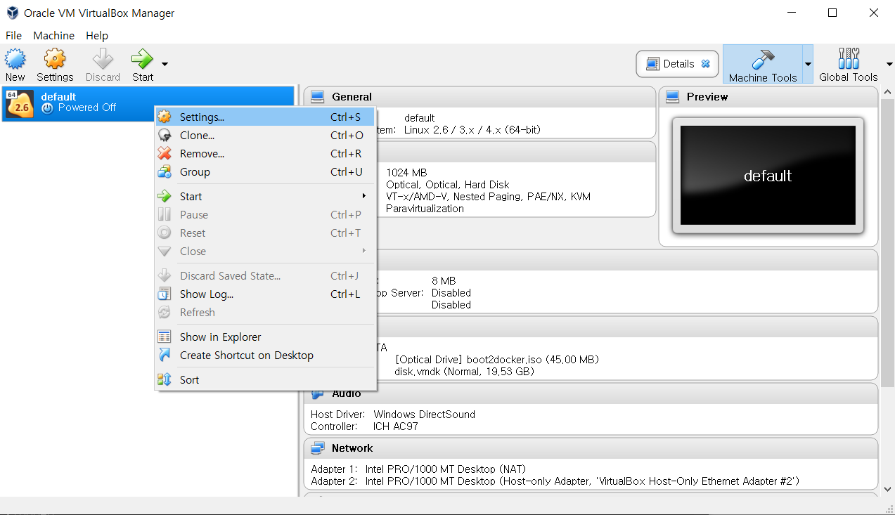
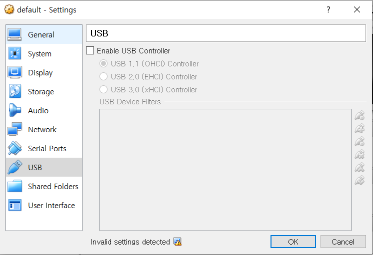
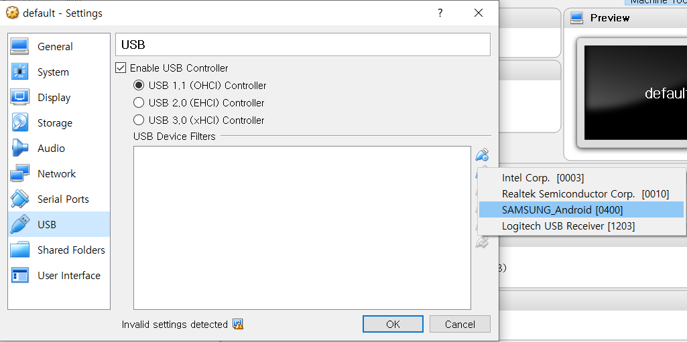
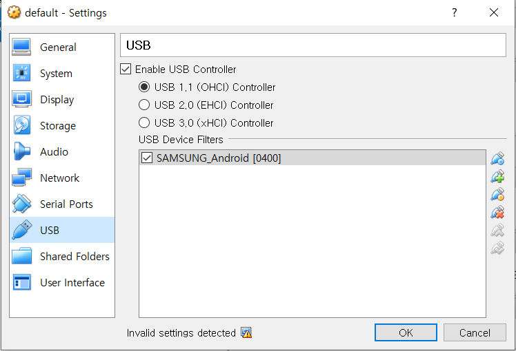

Docker Toolbox installation for Android Device
==============================================
Docker Toolbox를 설치하고 Android 장비를 사용하기 위한 환경 구성을 설명합니다.<br/>
문서 작성 당시에는 Docker Toolbox 최신 버전이 v19.03.1이며, 이 버전에서 사용하기 위한 방법을 설명합니다.<br/>
Docker Toolbox v19.03.1 버전에서는 Virtualbox와 Windows 10 Host 사이에 Shared folder와 관련된 버그가 있습니다.<br/>
해당 버그를 해결하는 방법을 함께 설명합니다.

Installation
------------ 
1. 'Docker Toolbox for Windows' 설치 - 참조 : [Install Docker Toolbox on Windows](https://docs.docker.com/toolbox/toolbox_install_windows/)

2. 'Docker Quickstart Terminal' 실행
```
### Docker machine 종료 및 제거
$ docker-machine.exe stop
$ docker-machine.exe rm default

### 새로운 boot2docker 이미지를 사용하여 새로운 Docker machine 생성
$ docker-machine.exe create --virtualbox-boot2docker-url https://github.com/boot2docker/boot2docker/releases/download/v18.09.8/boot2docker.iso default

### Docker machine 종료
$ docker-machine.exe stop
```

3. 실행중인 'Docker Quickstart Terminal 종료'

4. Virtualbox를 실행하여 docker-machine이 Android장비를 사용할 수 있게 설정합니다.





5. 'Docker Quickstart Terminal' 실행
```
### Home directory로 이동
$ cd ~

### Test 수행 디렉토리 생성
$ mkdir APPTESTAI_TEST
$ cd APPTESTAI_TEST

### runtest.sh 스크립트 다운로드 후 테스트 수행
APPTESTAI_TEST$ wget https://raw.githubusercontent.com/forcemax/apptestai/master/runtest.sh
APPTESTAI_TEST$ chmod u+x runtest.sh
APPTESTAI_TEST$ ./runtest.sh -d ce0817182be9566f0b -f application.apk
```

6. Windows에서 해당 결과를 확인
```
C:\Users\<MY ACCOUNT>\APPTESTAI_TEST\
```
