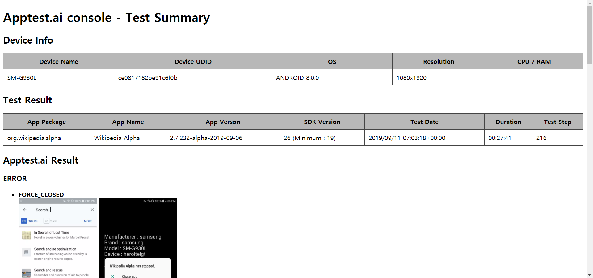

Apptest.ai Console Test Tool
=============
Apptest.ai Console Test Tool은 간단한 방법으로 자신의 PC에서 자신의 Android 장비를 사용하여 Apptest.ai Test를 수행할 수 있는 도구입니다.


Installation
------------
1. Install [Docker](https://www.docker.com/)
2. Pull the Docker image : ```docker pull apptestai/apptestai-docker```

Windows/Mac은 자신의 Android 장비를 사용하기 위하여 [Docker Desktop](https://www.docker.com/products/docker-desktop)이 아닌 [Docker Toolbox](https://docs.docker.com/toolbox/)를 사용해야하며, 이를 위한 문서는 다음에서 확인할 수 있습니다.<br/>
[Docker Toolbox Installation for Android Device](DockerToolbox.md)

Usage
-----
**Pre-Requisites:** 
1. Ubuntu 18.04 LTS (https://ubuntu.com)
2. Docker 19.03 (latest) (https://docs.docker.com/install/linux/docker-ce/ubuntu/)
3. Android SDK - adb 명령 필요
4. Android 5.0 lollipop 이상의 버전을 사용하는 장비
5. Test 수행할 APK 파일 - application.apk

**장비 UDID 확인**
```
$ adb devices
* daemon not running; starting now at tcp:5037
* daemon started successfully
List of devices attached
ce0817182be9566f0b      device
```

**Pull Apptest.ai docker image**
```
$ docker pull apptestai/apptestai-docker
```

**Apptest.ai Test 실행**
```
### Test 수행 디렉토리 생성
$ mkdir APPTESTAI_TEST
$ cd APPTESTAI_TEST

### runtest.sh 스크립트 다운로드 후 테스트 수행
APPTESTAI_TEST$ curl -o runtest.sh https://raw.githubusercontent.com/forcemax/apptestai/master/runtest.sh
APPTESTAI_TEST$ chmod u+x runtest.sh
APPTESTAI_TEST$ ./runtest.sh -d ce0817182be9566f0b -f application.apk
```

**Method Tracer 실행**

APK 파일이 debuggable하게 패키징되어 있으면 자동으로 Method Tracer를 실행합니다.<br/>
Method Tracer가 실행중에는 UI 반응 및 데이터 처리가 늦어집니다. 이로 인해 debuggable하지 않은 APK를 테스트하는 경우에 비해서 Test steps가 적어집니다.<br/>
Method Tracer의 결과는 output/trace 디렉토리에 저장됩니다.

Test Result
-----------
테스를 수행하고나면 현재 디렉토리의 아래에 output 디렉토리가 생성되며 다음과 같은 구조로 되어있습니다.

    .
    └── output
        ├── logs                # logcat log, apptestai script log, etc...
        ├── screenshots         # screenshots, xml, action metadata
        ├── screenrecord        # screen record video file
        ├── trace               # method tracer files
        ├── TEST-result.html
        ├── TEST-result.json
        ├── application.apk
        ├── console.log
        └── credentials.csv

TEST-result.html 파일을 열어서 Apptest.ai Test 결과를 확인할 수 있습니다.

